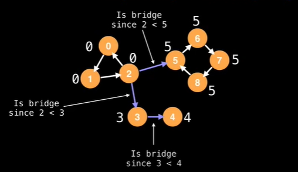

```C++

#include<iostream>
#include<vector>
#include<queue>
#include<utility>
int nodeNo=0;
typedef std::pair<int,int> Pair;
typedef std::vector<int> Vector;
void DFS(Vector* graph,int Vertices, bool* visited,int CurrVertex,int parent,std::vector<Pair> &bridges,int* markings,int* mainArray)
{   
    
    if(visited[CurrVertex])
    return;
    visited[CurrVertex]=true;
    mainArray[CurrVertex]=markings[CurrVertex]=nodeNo;
    nodeNo++;
    for(int nextVertex:graph[CurrVertex])
    {   
        if(parent==nextVertex)
        continue;
        if(!visited[nextVertex])
        {
            DFS(graph,Vertices,visited,nextVertex,CurrVertex,bridges,markings,mainArray);
            mainArray[CurrVertex]=std::min(mainArray[CurrVertex],mainArray[nextVertex]);
        }
        
      
        else{
            mainArray[CurrVertex]=std::min(mainArray[CurrVertex],markings[nextVertex]);
        }

        if(mainArray[CurrVertex]<mainArray[nextVertex])
        bridges.push_back({CurrVertex,nextVertex});

    }
}
int main()
{   
    int startVertex=0;
    int Nodes=8;
    int arrLength=Nodes+1;

    // intialise with component no zero
    Vector graph[arrLength];

  
   
    graph[0].push_back(1);
    graph[1].push_back(0);
    graph[1].push_back(2);
    graph[2].push_back(1);
    graph[0].push_back(2);
    graph[2].push_back(0);
    graph[0].push_back(3);
    graph[3].push_back(0);
    graph[3].push_back(4);
    graph[4].push_back(3);
    graph[0].push_back(5);
    graph[5].push_back(0);
    graph[7].push_back(5);
    graph[5].push_back(7);
    graph[5].push_back(6);
    graph[6].push_back(5);
    graph[6].push_back(7);
    graph[7].push_back(6);
    graph[6].push_back(8);
    graph[8].push_back(6);
    graph[5].push_back(8);
    graph[8].push_back(5);


    std::vector<Pair> Bridges;
    bool visited[arrLength]={false};

    int markings[arrLength]={0};
    int mainArray[arrLength]={0};
    for(int vertex=startVertex;vertex<=Nodes;vertex++)
    {   
        
        if(!visited[vertex])
        {   
          
            DFS(graph,arrLength,visited,vertex,-1,Bridges,markings,mainArray);
        }
        
    }

    for(auto bridge:Bridges)
    std::cout<<bridge.first<<" "<<bridge.second<<"\n";
   

  
   
}


```

## TC - V+E