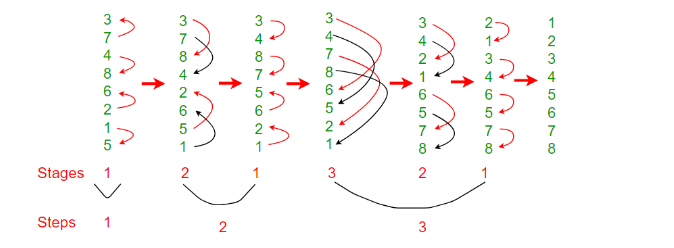

# Bitonic Sort
#### Bitonic Sort is a classic parallel algorithm for sorting. 

#### The number of comparisons done by Bitonic sort is more than popular sorting algorithms like Merge Sort [ does O(log N) comparisons], but Bitonic sort is better for parallel implementation because we always compare elements in a predefined sequence and the sequence of comparison doesn’t depend on data. Therefore it is suitable for implementation in hardware and parallel processor array. Bitonic Sort can only be done if the number of elements to sort is 2^n. The procedure of bitonic sequence fails if the number of elements is not in the aforementioned quantity precisely.

## Bitonic Sequence
#### A sequence is called Bitonic if it is first increasing, then decreasing. In other words, an array arr[0..n-i] is  Bitonic if there exists an index I, where 0<=i<=n-1 such that  

#### x0 <= x1 …..<= xi  and  xi >= xi+1….. >= xn-1 



#### Basic idea is like merge sort, first sort left and right partitions then merge them, merge will be called recursively by itself until merged array is completely sorted.

#### here we are using only one processor and one thread.
```C++
#include <iostream>

using namespace std;

template <typename t>
void Swap(t &a, t &b)
{

    t temp = a;
    a = b;
    b = temp;
}
void merge(int *arr, int start, int N, int dir)
{
    if (N <= 1)
        return;
    for (int i = start; i < start + N / 2; i++)
    {
        // dir is involved while swappping ,
        // if left one is larger and we
        // are working for increasing
        // then condn will be 1 and swap will occur

        if (dir == (arr[i] > arr[i + N / 2]))
            Swap(arr[i], arr[i + N / 2]);
    }

    merge(arr, start, N / 2, dir);
    merge(arr, start + N / 2, N / 2, dir);
}
void bitonicSort(int *arr, int start, int N, int dir)
{
    if (N <= 1)
        return;
    bitonicSort(arr, start, N / 2, 1);
    bitonicSort(arr, start + N / 2, N / 2, 0);
    merge(arr, start, N, dir);
}
int32_t main()
{
    int arr[] = {1, 3, 7, 5, 2, 4, 8, 6};
    bitonicSort(arr, 0, sizeof(arr) / sizeof(arr[0]), 1);
    // 1 for ascending

    for (auto i : arr)
        cout << i;
    // 12345678
}


```


## Time complexity: ( parallel )
### Best Case: O(log^2n)
### Average Case: O(log^2n)
### Worst Case: O(log^2n)
#### nlog^2n without parallel
## Space Complexity: O(nlog^2n)

