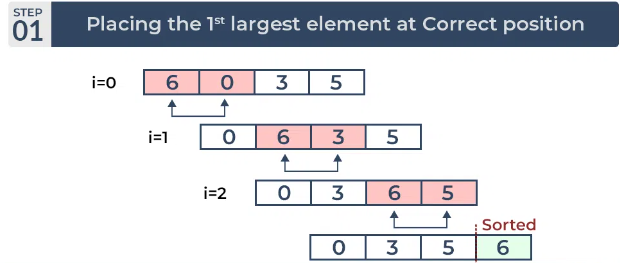
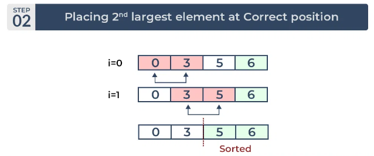
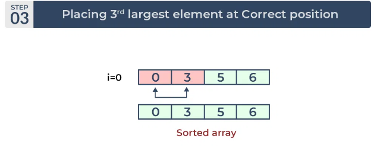

# Bubble Sort 

## Bubble Sort is a sorting algorithm that works by repeatedly swapping the adjacent elements if they are in the wrong order. This algorithm is not suitable for large data sets as its average and worst-case time complexity is quite high.







### Basic idea is to itearte over array  and in each iteration swapping adjacent elements if right one is smaller this way , in one iteration largest element will be in then end. Similarly, in each iteration, next largest element will go to end-i i represets elements which already been placded to right

### If in any iteration, we find out there are no swaps then we can stop iterations as array is sorted now.

```C++


void swap(int &i,int &j)
{
    int temp=i;
    i=j;
    j=temp;
}
void bubbleSort(vector<int>& arr, int n)
{   
    
    for(int i=0;i<n;i++)
    {   
        bool isSorted=true;
        for(int j=1;j<n-i;j++)
        {
            if(arr[j-1]>arr[j])
            {
            swap(arr[j-1],arr[j]);
            if(isSorted)isSorted=false;
            }
            
        }
        if(isSorted)
        break
    }
}

```
## Time and Space Complexity
### Time - O(N^2)
### Space - O(1)
## It is stable and inplace.
## Advantages of Bubble Sort
### It is a stable sorting algorithm, meaning that elements with the same key value maintain their relative order in the sorted output.
### Disadvantages of Bubble Sort
### Bubble sort has a time complexity of O(N2) which makes it very slow for large data sets.