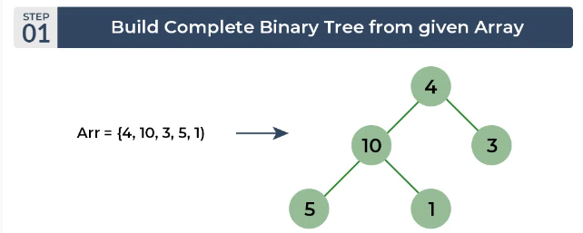

# Heap Sort

#### Heap sort is a comparison-based sorting technique based on Binary Heap data structure.




#### First heapify array, according to order which you want either max-heap ( if increasing order required ) or vice versa, then take first element and put last element in its place and heapify from root to bottom ( ignored sorted last elments(s) ). Repeat the step until array is sorted.


```C++
#include <iostream>

using namespace std;

void heapify(int* arr, int N, int curr)
{
       
        int leftChild=2*curr+1;
        int rightChild=2*curr+2;
        int largerChild=curr;
        if(leftChild<N && arr[leftChild]>arr[largerChild])
        largerChild=leftChild;
        
        if(rightChild<N && arr[rightChild]>arr[largerChild])
        largerChild=rightChild;
        if (largerChild!=curr)
        {
            swap(arr[curr],arr[largerChild]);
            heapify(arr,N,largerChild);
        }
}
void heapSort(int* arr,int N)
{
    int curr=N/2-1;
    while(curr>=0)
    {
        heapify(arr,N,curr);
        curr-=1;
    }
    for(int i=0;i<N-1;i++)
    {   
        int last=N-1-i;
        swap(arr[0],arr[last]);
        heapify(arr,last,0);

    }

}
int32_t main()
{
    int arr[] = {5,7,4,8,1,5,2,9 };
    int N=sizeof(arr)/sizeof(arr[0]);
    // after heapify 
    heapSort(arr,N);
    for (auto i : arr)
        cout << i;
    // 12455789
}

```

## Important points about Heap Sort:
#### Heap sort is an in-place algorithm. 

## Advantages of Heap Sort:
### Efficient Time Complexity: Heap Sort has a time complexity of O(n log n) in all cases. This makes it efficient for sorting large datasets. The log n factor comes from the height of the binary heap, and it ensures that the algorithm maintains good performance even with a large number of elements.
### Memory Usage – Memory usage can be minimal (by writing an iterative heapify() instead of a recursive one). So apart from what is necessary to hold the initial list of items to be sorted, it needs no additional memory space to work
### Simplicity –  It is simpler to understand than other equally efficient sorting algorithms because it does not use advanced computer science concepts such as recursion.
## Disadvantages of Heap Sort:
### Costly: Heap sort is costly as the constants are higher compared to merge sort even if the time complexity is O(n Log n) for both.
### Unstable: Heap sort is unstable. It might rearrange the relative order.
### Efficient: Heap Sort is not very efficient when working with highly complex data. 