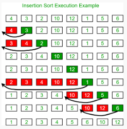

# Insertion Sort
#### Insertion sort is a sorting algorithm that places an unsorted element at its suitable place in each iteration.




#### Basic idea is to iterate over array , pick up  an element , if prev ele is <= curr then just continue otherwise just find ele > curr from left array ( index 0 to curr-1) and place curr in its correct position and shift right one place elements starting from curr element's correct position to its prevous position.
```C++

#include <iostream>

using namespace std;

void insertionSort(int* arr,int N)
{   
    
    for(int i=1;i<N;i++)
    {   
        if(arr[i]>=arr[i-1])
        continue;
        int curr=arr[i];
        int j=i-1;
        while(j>=0)
        {
            if (arr[j]>curr)
            {
               arr[j+1]=arr[j];
               j--;
            }
            else{
                break;
            }
            
        }
        arr[++j]=curr;

        
    }


}
int32_t main()
{
    int arr[] = {1, 3, 7, 5, 2, 4, 8, 6};
    insertionSort(arr,sizeof(arr)/sizeof(arr[0]));
    for (auto i : arr)
        cout << i;
    // 12345678
}


```


## Time Complexity: O(N^2) 
## Auxiliary Space: O(1)

## Time Complexity of Insertion Sort
### The worst-case time complexity of the Insertion sort is O(N^2)
### The average case time complexity of the Insertion sort is O(N^2)
### The time complexity of the best case is O(N).
## Space Complexity of Insertion Sort
### The auxiliary space complexity of Insertion Sort is O(1)

## Characteristics of Insertion Sort
#### This algorithm is one of the simplest algorithms with a simple implementation
#### Basically, Insertion sort is efficient for small data values
#### Insertion sort is adaptive in nature, i.e. it is  appropriate for data sets that are already partially sorted