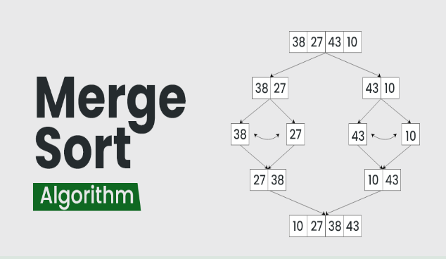

# Merge Sort

#### Merge sort is defined as a sorting algorithm that
####  works by dividing an array into smaller subarrays, 
####  sorting each subarray, and then merging the sorted 
####  subarrays back together to form the final sorted array.
#### 
#### In simple terms, we can say that the process of merge 
#### sort is to divide the array into two halves, sort each half,
####  and then merge the sorted halves back together.
####   This process is repeated until the entire array is sorted.



```C++
#include <iostream>

using namespace std;

void merge(int *arr, int start, int end, int mid)
{
    if (start >= end)
        return;
    int n1 = mid - start + 1;
    int n2 = end - mid;

    int *temp1 = new int[n1];
    int *temp2 = new int[n2];
    for (int i = start; i <= mid; i++)
        temp1[i - start] = arr[i];

    for (int i = mid + 1; i <= end; i++)
        temp2[i - mid - 1] = arr[i];

    int leftArrayIndex = 0;
    int rightArrayIndex = 0;
    int currIndex = start;
    while (leftArrayIndex < n1 && rightArrayIndex < n2)
    {

        if (temp1[leftArrayIndex] < temp2[rightArrayIndex])
        {
            arr[currIndex] = temp1[leftArrayIndex];
            leftArrayIndex++;
        }
        else
        {
            arr[currIndex] = temp2[rightArrayIndex];
            rightArrayIndex++;
        }
        currIndex++;
    }

    while (leftArrayIndex < n1)
    {
        arr[currIndex] = temp1[leftArrayIndex];
        leftArrayIndex++;
        currIndex++;
    }

    while (rightArrayIndex < n2)
    {
        arr[currIndex] = temp2[rightArrayIndex];
        rightArrayIndex++;
        currIndex++;
    }
    delete[] temp1;
    delete[] temp2;
}
void mergeSort(int *arr, int start, int end)
{
    if (start >= end)
        return;
    int mid = start + (end - start) / 2;
    mergeSort(arr, start, mid);
    mergeSort(arr, mid + 1, end);
    merge(arr, start, end, mid);
}
int32_t main()
{
    int arr[] = {1, 3, 7, 5, 2, 4, 8, 6};
    mergeSort(arr, 0, sizeof(arr) / sizeof(arr[0]) - 1);
    for (auto i : arr)
        cout << i;
    // 12345678
}
```
### Time Complexity: O(N log(N)), 
####  Merge Sort is a recursive algorithm and
####  time complexity can be expressed as following recurrence relation. 
#### T(n) = 2T(n/2) + θ(n)

#### Auxiliary Space: O(N)+ logN, In merge sort all elements are copied 
#### into an auxiliary array. So N auxiliary space is required for merge sort.
### + log(N) for stack

#### Advantages of Merge Sort:
#### Stability: Merge sort is a stable sorting algorithm,
####  which means it maintains the relative order of equal
####   elements in the input array.
#### Guaranteed worst-case performance: Merge sort has a
####  worst-case time complexity of O(N logN), which means
####   it performs well even on large datasets.
#### Parallelizable: Merge sort is a naturally parallelizable
####  algorithm, which means it can be easily parallelized to 
####  take advantage of multiple processors or threads.
#### Drawbacks of Merge Sort:
#### Space complexity: Merge sort requires additional memory to
####  store the merged sub-arrays during the sorting process. 
#### Not in-place: Merge sort is not an in-place sorting algorithm,
####  which means it requires additional memory to store the sorted 
####  data. This can be a disadvantage in applications where memory 
####  usage is a concern.
#### Not always optimal for small datasets: For small datasets, Merge
####  sort has a higher time complexity than some other sorting algorithms,
####   such as insertion sort. This can result in slower performance 
####   for very small datasets.
