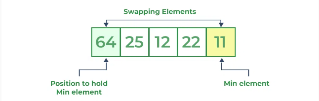
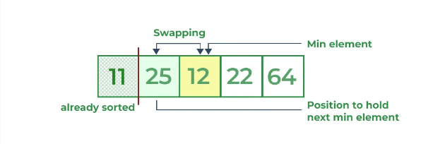
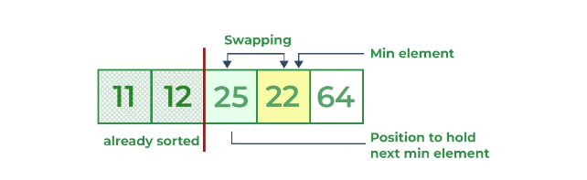
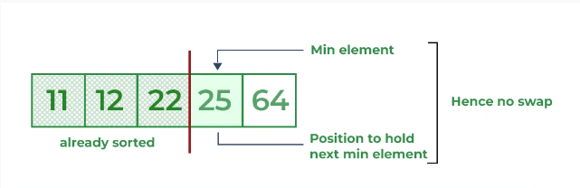

# Selection Sort

## Selection sort is a simple and efficient sorting algorithm that works by repeatedly selecting the smallest (or largest) element from the unsorted portion of the list and moving it to the sorted portion of the list. 







### Basic idea is select samllest element in each iteration and place it in start-i position, i represents elements which already have been placed to its correct positon.

```C++

void swap(int &i,int &j)
{
    int temp=i;
    i=j;
    j=temp;
}
void selectionSort(vector<int>& arr, int n)
{   
    
    for(int i=0;i<n;i++)
    {   int min=arr[i];
        int min_indx=i;
        for(int j=i;j<n;j++)
        {
            if (arr[j]<min){
                min=arr[j];
                min_indx=j;
            }
        }
        if(min_indx!=i)
        swap(arr[i],arr[min_indx]);
    }
}

```
## Time and Space Complexity
### Time - O(N^2)
### Space - O(1)

## It is unstable and inplace.

## Advantages of Selection Sort Algorithm
### Simple and easy to understand.
### Works well with small datasets.
## Disadvantages of the Selection Sort Algorithm
### Selection sort has a time complexity of O(n^2) in the worst and average case.
### not work well on large datasets.
### not preserve the relative order of items with equal keys which means it is not stable.


### Selection sort can be made Stable if instead of swapping, the minimum element is placed in its position without swapping i.e. by placing the number in its position by pushing every element one step forward(shift all elements to left by 1). 
### In simple terms use a technique like insertion sort which means inserting element in its correct place. 